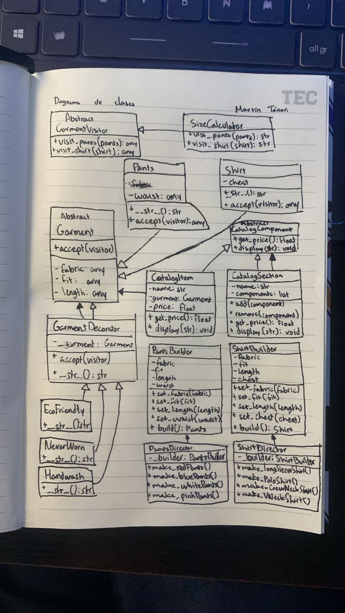

# ProyectoIntegrador3.8

Desarrollo e implantación de sistemas de software

4 patrones de diseño y su justificación:

1 Patrón creacional.

- Builder:
  Originalmente primero quise ver qué podría crear, entonces no tenía nada en mente cuando veía las opciones de patrones. Sin embargo, cuando vi el patrón de diseño Builder, intenté crear un pantalón porque se me ocurrió. Pensé que podría crear pantalones y distinguirlos por su tela, corte, etc. De esta manera, a pesar de no tener un problema aún, se me habían abierto las puertas para ver qué puedo hacer con estos pantalones ahora.

1 Patrón estructural.

- Composite:
  Con tantos pantalones, pensé que tal vez sería bueno organizarlos como en un tipo de catálogo, por lo que me fijé en el patrón Composite para crearlo. Creé un catálogo llamado Closet, en el que ahí añadí los distintos pantalones creados y los podía desplegar ahí mismo. Aparte les agregué un valor monetario nomás para diferenciarlos aún más. Implementando este patrón, obtuve un tipo de "menú" para desplegar en la consola todos los pantalones que tenía registrados, aparte que me di cuenta que ahora podría agregar otra sección para otro tipo de prenda: camisas.

1 Patrón de comportamiento.

- Visitor:
  Quería especificar más información de las prendas de ropa, entonces pensé en ponerles talla. Sin embargo, no quería solamente dar la letra de la talla, por lo que pensé que sería divertido ingresar una medida en pulgadas y que después el código calcule la talla que debería ser esa prenda. Tomando eso en cuenta, opté por agarrar el patrón Visitor, para diferenciar cómo las medidas proporcionadas diferenciaban la talla dependiendo de si era sobre un pantalón o una camisa. Con ese patrón logré realizar el cálculo para ahora especificar la talla en el Clóset, sin necesidad de mostrar las medidas de las prendas.

1 cualquiera de los anteriores.

- Decorator:
  Tomando en cuenta lo ridículamente específico que se estaba poniendo este programa a la hora de desplegar las prendas que se tenían en este clóset, pensé en llevarlo aún más allá. Implementando el patrón de Decorator, fue posible agregarle una nota a cada una de las prendas. Estas notas pueden ser sobre lo que sea realmente, pero por el momento nomás dejé algunos ejemplos. Incluso se podría añadir una nota para diferenciar si una prenda es mi favorita o algo así. Ahora con este último patrón, estos pantalones y camisas son desplegadas con el detalle que se merecen ante cualquier usuario.

Diagrama de clases del proyecto en UML:

